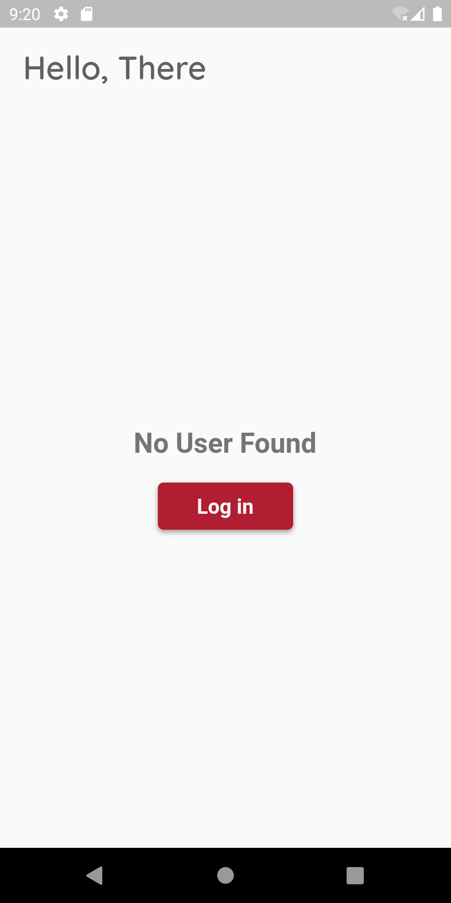
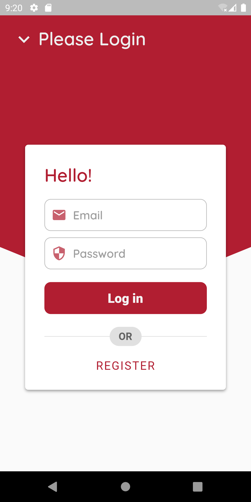
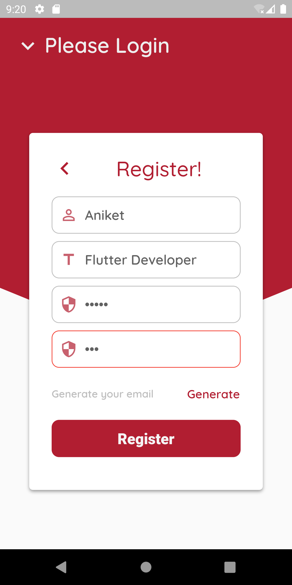
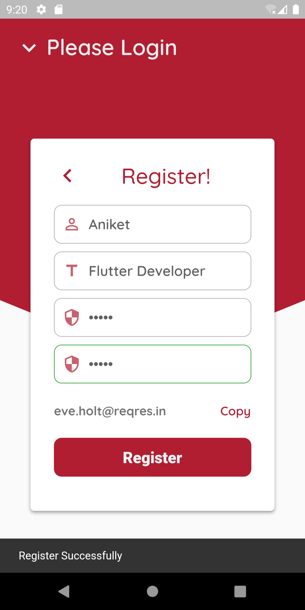
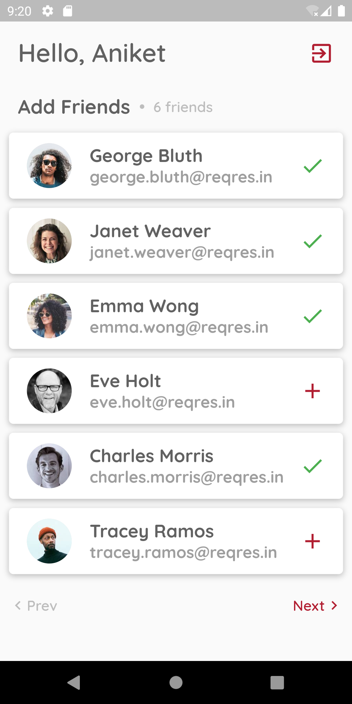

# User Management App

This is a flutter app for showing the user management using the `shared_preference`.

## Screenshots

Here is a screenshot of the app:

<p float="left">






</p>

## Getting Started

To run this app, you will need the Flutter SDK.

1. [Install Flutter](https://flutter.dev/docs/get-started/install)
2. Clone this repository
3. Download [Fonts](https://fonts.google.com/) in (copy the `.ttf` of variable weight):
```yaml
fonts:
    - family: Baloo Tammudu 2
      fonts:
        - asset: assets/fonts/BalooTammudu2.ttf

    - family: Quicksand
      fonts:
        - asset: assets/fonts/Quicksand-Regular.ttf
        - asset: assets/fonts/Quicksand-Light.ttf
          weight: 200
        - asset: assets/fonts/Quicksand-Medium.ttf
          weight: 600
        - asset: assets/fonts/Quicksand-Bold.ttf
          weight: 900
        - asset: assets/fonts/Quicksand-SemiBold.ttf
          weight: 800
```
4. Navigate to the project directory in your terminal
5. Run `flutter run` to start the app

## Dependencies

```yaml
dependencies:
  flutter:
    sdk: flutter
  cupertino_icons:
  shared_preferences:
  http:
  path:
  sqflite:
  flutter_svg:
  cached_network_image:
```


## Credits

- [Flutter](https://flutter.dev)
- [Dart](https://dart.dev)
